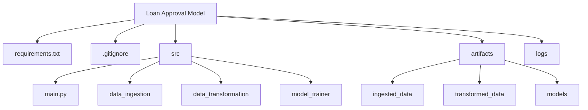

# AI Engineer Technical Assessment - Relaxy


Dear Candidate,

Welcome to the hands-on technical assessment for the AI Engineer position at Relaxy! We're excited to evaluate your MLOps and engineering capabilities through this practical examination.

In this assessment, you'll be working with our Loan Approval prediction system, a real-world ML pipeline that demonstrates many of the challenges you'll tackle at Relaxy. We've designed this assessment to evaluate not just your coding abilities, but also your understanding of MLOps best practices, system design, and production considerations.

You'll be working on implementing critical production features that would help scale and monitor our ML systems. Take your time to understand the existing codebase before diving into the tasks. Remember, we value clean, maintainable code with proper documentation over quick implementations.

## Getting Started with the Codebase


### Context
The Loan Approval Model codebase represents a production-grade ML pipeline that handles loan approval predictions. The system includes modular components for data ingestion, transformation, and model training, built with scalability and maintainability in mind. This foundation provides an excellent starting point for implementing advanced MLOps capabilities.

### Initial Setup Instructions

1. **Clone the Repository**
   ```bash
   git clone https://github.com/relaxy-intel/relaxy-ai-engineer-exam-question.git
   cd Loan-Approval-Model
   ```

2. **Create and Activate Virtual Environment**
   ```bash
   python -m venv venv
   
   # Activate the venv
   source venv/bin/activate
   ```

3. **Install Dependencies**
   ```bash
   pip install -r requirements.txt
   ```

4. **Prepare Dataset**
   - Place the provided `loan_approval_dataset.csv` in the `dataset` directory
   - Ensure the file permissions are correctly set

5. **Run the Base Pipeline**
   ```bash
   python src/main.py
   ```

6. **Verify Setup**
   - Check `logs` directory for execution logs
   - Examine `artifacts` directory for pipeline outputs
   - Verify model training completion

### Pipeline Exploration Tips

1. **Code Structure Review**
   - Examine the modular architecture
   - Understand component interactions
   - Review configuration management
   - Study error handling implementation

2. **Output Analysis**
   - Review logging patterns
   - Examine generated artifacts
   - Check model performance metrics
   - Analyze data transformation steps

3. **Experimentation Ideas**
   - Try different model parameters
   - Test with various data samples
   - Modify transformation logic
   - Add new validation steps

4. **Debugging Support**
   - Use logging information
   - Check error messages
   - Review execution flow
   - Monitor resource usage

Remember: Take time to understand the existing implementation before starting your tasks. This will help you make better design decisions for your enhancements.

## Ready to Begin?

Once you're comfortable with the codebase:
1. Review the assessment tasks thoroughly
2. Plan your implementation approach
3. Create a new branch for your work
4. Document your design decisions
5. Implement your solutions
6. Test thoroughly before submission

If you have any questions about the setup or requirements, please don't hesitate to ask. Good luck with your assessment!

Best regards,

The Relaxy Engineering Team
